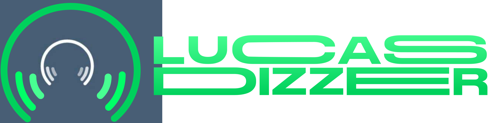

  
  

### - Fui desafiado a fazer uma aplicação que faz requisição à API do Deezer e retorna a lista das músicas mais tocadas. O desafio também incluía a criação de uma lista de músicas marcadas como favoritas.
### - No projeto tive que praticar bastante o Redux, pois foi um requisito do desafio. Os quatro objetos usados no Redux foram:
#### *allMusics : Onde o resultado da requisição feita na API do Deezer é salvo.
#### *favoritList: Onde as músicas selecionadas como favoritas são salvas.
#### *selectedMusic: Quando uma música é selecionada, ela fica salva neste objeto.
#### *isRequest: Nele possui um valor booleano onde é dito se a aplicação está fazendo requisição ou não.

### Fiquei muito satisfeito em fazer este projeto, pois sei que ele me fez crescer profissionalmente :D
### - Nesta aplicação foram usados as seguintes tecnologias:

#### *React JS
#### *Redux
#### *Styled Component
#### *Material UI

### Demonstração da aplicação

### Como visualizar aplicação em sua máquina:

#### 1º Passo: Instale o git, veja o passo a passo em https://git-scm.com/downloads
#### 2º Passo: Instale o node, veja o passo a passo em https://nodejs.org/en/download/
#### 3º Passo: Abra o terminal como administrador e execute o comando: ' git clone https://github.com/lucasmetron/desafioDeezerReact.git '
#### 4º Passo: Digite o comando ' cd desafioDeezerReact ' para acessar a pasta do projeto
#### 5º Passo: Digite o comando ' npm install ' e ao finalizar digite o comando ' npm start '
#### 6º Passo: A API do Deezer possui restrições para requisições vinda de navegadores, por isso precisei utilizar a API do CORS Anywhere. Caso ao abrir a aplicação a lista de músicas não apareça, basta clicar no link que irá aparecer e clicar no botão 'Request temporary access to the demo server'. Feito isso, basta voltar para a aplicação e atualizar a página.

### Gostou do meu projeto!? :D Entre em contato comigo! 
[Linkedin](https://www.linkedin.com/in/lucas-rosa-058683102/)  
[Email: lucasmetron@gmail.com](mailto:lucasmetron@gmail.com)
